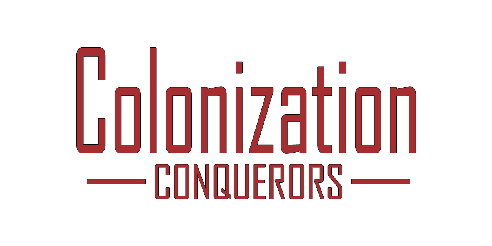
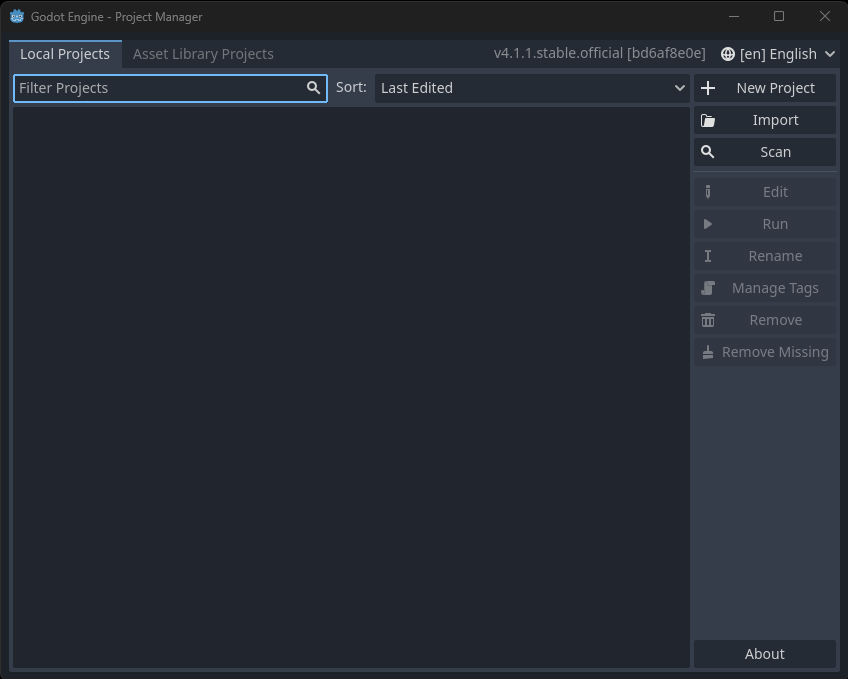
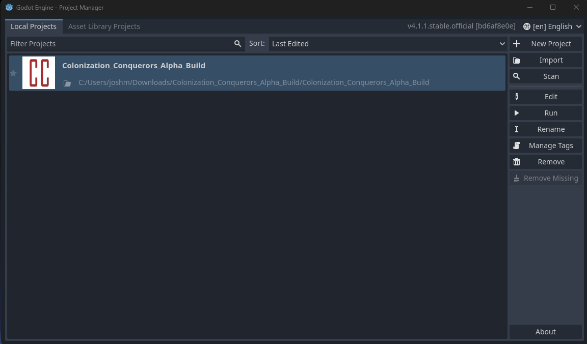
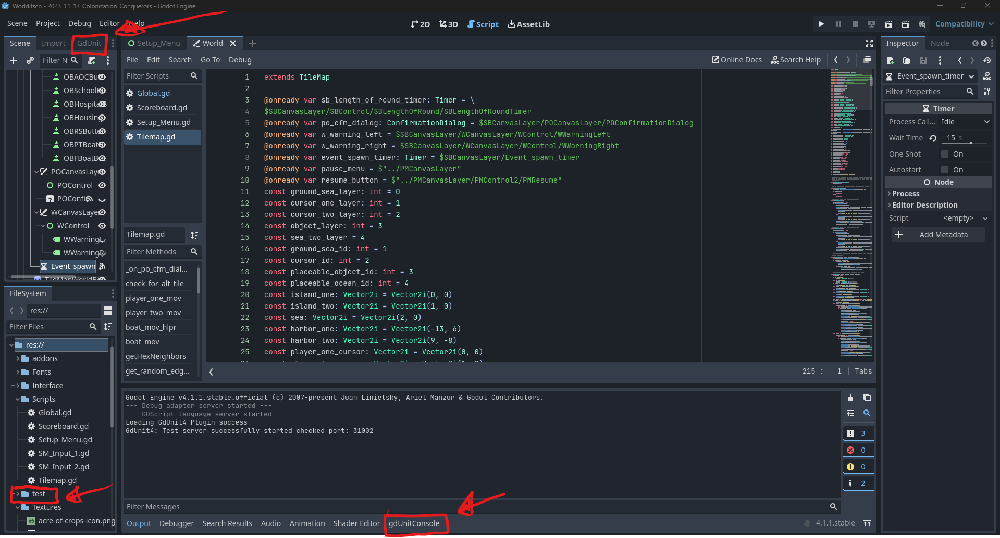
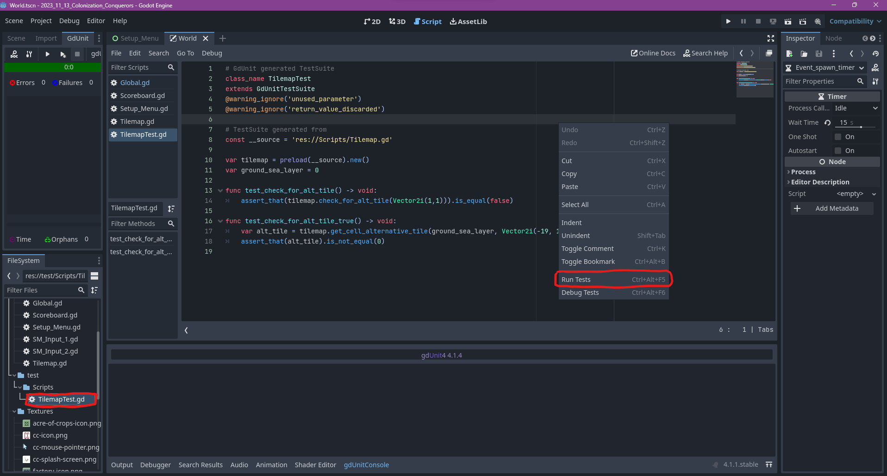
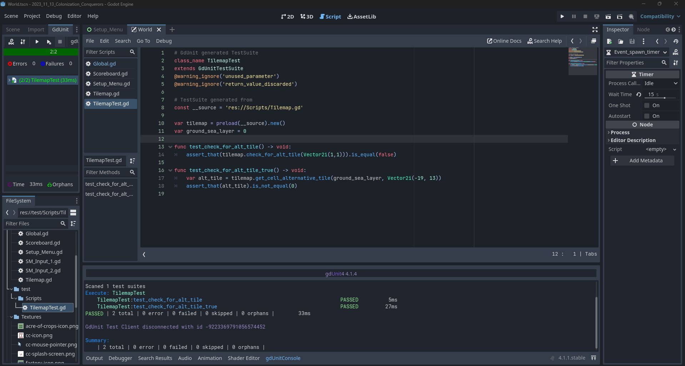
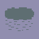
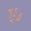

## Repository Contents:
- Source Code - Located in **LatestBuild**: The heart of our project lies here, where we've meticulously crafted the game's functionality and mechanics.
- Living Document: This document provides an overview of the project, team information, major features, stretch goals, use cases, non-functional requirements, and more. It serves as your guide to Colonization Conquerors.
- Weekly Reports: Our weekly reports detail our progress and accomplishments, helping you stay up to date with our development journey.
- Projects: The Projects page outlines our scheduled tasks, assignments, and responsibilities for each team member, offering insight into our project's ongoing development.
- README: This top-level README file contains an introduction to our project including, who it is for, how to run, test, and build the software, as well as the rules of the game.

### Product Description:
Colonization Conquerors is set to be developed as a turn-based strategy PC game inspired by the classic Utopia (1982). The game revolves around building and creating a civilization, resource management, and competitive gameplay to win matches. It aims to blend the nostalgia of Utopia's core gameplay with different visuals, and user experience enhancements.
___
### **Major Features:**

- Island Development:
  - Players can create and advance their island through the construction of diverse structures, including crops, factories, and forts. Each of these structures serves distinct functions, such as sustaining the population, generating revenue, or fortifying against potential attacks.
- Resource Management:
  - Managing resources is a crucial aspect of the game. Players need to allocate resources wisely to ensure the growth and prosperity of their island. Achieving success hinges on the strategic allocation of construction efforts.
- Interaction with Rival Players:
  - "Colonization Conquerors" delivers a local two-player competitive gaming experience, enabling players to fund rebel activities on their opponent's island and incite confrontations between their PT boats and the rival's fishing boats.
- Natural Disasters & Events:
  - Random disasters and events can occur in the game, adding an element of unpredictability. These events, such as rain storms or hurricanes, can have both positive and negative effects on a player's construction.

___
### Use Case:
Colonization Conquerors is a game for people who want to experience a strategy-focused, island city-building adventure where you compete against your opponent to see who can amass the most wealth and power!

**Implemented Use Cases**
| Use Case 1    | Player Building & Island Development |
| -------- | ------- |
| Actor | Player |
| Trigger | The player desires to initiate construction and  development on an island within Colonization Conquerors. |
| Preconditions | The player has started a new match. |
| Postconditions  (Success Scenario) | The player successfully builds and develops his land in Colonization Conquerors. |
| List of Steps  (Success Scenario) | a. The player constructs objects on the island.  b. The player manages resources and continues expanding the island. |
| Extensions/Variations  of the Success Scenario | The player can choose different structures and  resource allocation strategies. |
| Exceptions: Failure  Conditions & Scenarios | If the player’s resources are insufficient, the chosen  structures cannot be built. |

| Use Case 2    | Competitive Gameplay & Interaction with Rival Player |
| -------- | ------- |
| Actor | Players |
| Trigger | Player 1 and Player 2 want to engage in competitive  gameplay with each other. |
| Preconditions | The players are in the same game. |
| Postconditions  (Success Scenario) | Player 1 and Player 2 participate in competitive  gameplay. |
| List of Steps  (Success Scenario) | a. Both players start a session with each other.  b. They allocate resources strategically and expand their island.  c. Each player decides to fund rebel activities on the other’s island.  d. Otherwise, a confrontation between their PT boats and fishing boats occurs.  e. Player 1 and Player 2 continue to compete and strategize. |
| Extensions/Variations  of the Success Scenario | Player 1 and Player 2 can employ different tactics  during gameplay. |
| Exceptions: Failure  Conditions & Scenarios | If the session ends too early, they cannot engage in  competitive gameplay. |

| Use Case 3    | Dealing with Random Natural Disasters |
| -------- | ------- |
| Actor | Player |
| Trigger | The player encounters a random storm cloud in the game. |
| Preconditions | The player initiates a new game. |
| Postconditions  (Success Scenario) | The player copes with the natural disaster. |
| List of Steps  (Success Scenario) | a. The player observes the impending storm cloud.  b. The player can either opt to move their boat to a different  location and/or proactively construct newer structures in a  distant area to avoid potential obstacles.|
| Extensions/Variations  of the Success Scenario | The outcome of the natural disaster can vary based on  the player’s preparations. |
| Exceptions: Failure  Conditions & Scenarios | Failure to act may result in a natural disaster  inflicting substantial damage upon the player’s  constructions. |

___
### How to Run the Game:
From GitHub, navigate this main page of the repository to the **Releases** link. From there you will find under **Assets** a folder called, **WindowsDesktop.zip** which can be downloaded to your machine. You can then extract the files from the zip folder which will contain an application called **ColonizationConquerors.exe**. Then, run the executable file to begin the game. 

**NOTE:** You may need to ask Windows to allow the game to run.

___
### How to Run the Project and Test Sweep:
If you wish to run the Godot project from the Godot editor, you can download Godot version 4.1.1 from the following: 

https://godotengine.org/download/archive/4.1.1-stable/ 

From this page, you can choose which operating system you wish to download. Since our team developed the software using the Windows version, it is recommended to use the Windows version of Godot as well. You will now have a zipped folder called **Godot_v4.1.1-stable_win64.exe** which you can extract. This folder contains an application called **Godot_v4.1.1-stable_win64** which is the self-contained Godot engine, no installation is required!

After opening the editor, you will see a project manager open. 

After this, download the Godot project zip folder called **Colonization_Conquerors_Alpha_Build.zip** from the root directory of this repository. Unzip the folder and you will find another folder called **Colonization_Conquerors_Alpha_Build**. This is the project folder that you will place into the Godot editor to access the internals of the project.

Drag and drop the **Colonization_Conquerors_Alpha_Build** project folder into the empty space shown below:

After double-clicking the project, you will then be met with the open project in the editor. Take note of the GdUnit tab, gdUnitConsole, and test folders marked below:

After selecting the two gdUnit tabs, if you navigate the test directory into Scripts and select a testing script, you can then right-click into the editor and select **Run Tests** as shown below:

As you can see, the tests located in that testing script were run and successfully completed:

After verifying that the tests run correctly, you can now run the game by either pressing **F5** or by pressing the **play** button at the top-right of the engine ribbon to play the project code.

___
### How to Play:
**Controls**

Moving Cursors:
- Use the S Z X C keys to move the Player One cursor and the L , . / keys to move the Player Two cursor.
- **NOTE: DO NOT** use the cursor to deploy rebels on your opponent's island or to buy a boat. The computer randomly places rebels, and boats materialize in your island harbor automatically upon purchase.

Placing Objects: 

| Object | Player One (key) | Player Two (key) |
| -------- | ------- | ------- |
| 
 Fort
 | 1 | 8 |
| 
 Factory
 | 2 | 9 |
| 
 Acre of Crops
 | 3 | 0 |
| 
 School
 | 4 | - |
| 
 Hospital
 | 5 | = |
| 
 Housing Project
 | Q | I |
| 
 Rebel Soldiers
 | W | O |
| 
 PT Boat
 | E | P |
| 
 Fishing Boat
 | R | [ |

Ship Control:
- Move the cursor over the boat, then use the F key (Player One) or J key (Player Two) to control fishing boats or PT boats. Press F or J to exit.

Interaction Mode:
- Use the \ key to switch between Interaction modes. By default, the Interaction mode is set to Player One.
- Left click using a mouse to move the player cursor to a cell. To place objects, press a button on the scoreboard and then confirm selection.

Pause Game:
- To pause the game, press the ESC key.
  - Resume button - Resume the game.
  - Retry button - Go back to the Setup Menu.
  - Exit button - Exit the application.

**Game Objective**
1. **Single Player:** Aim to achieve the highest possible score in the selected number of rounds (your term of office). Points represent the overall well-being of the people, earned and spent to enhance living conditions on your chosen island.
2. **Two Players:** Outscore your opponent by improving living conditions on your island, either through cooperation or by inciting rebellion and causing a loss of revenue on your opponent's island.
   - In a 1-player game, control one island and ignore the other.

**Setup Menu**
1. Use number keys to select the NUMBER OF ROUNDS (1 to 50) and press ENTER.
2. Use number keys to select the LENGTH OF EACH ROUND (30 to 120) and press ENTER.

**Gameplay**
- The scoreboard displays four numbers in each corner, representing gold bar count, population count, current score, and total score for both players.
- Random events such as rain clouds, pirate ships, tropical storms, schools of fish, and hurricanes are controlled by the computer.

    

**Governing your Island Kingdom**
- Accumulate points, not money, to win. Each player starts with 100 gold bars.
- Players can purchase items using gold bars, and rebels are placed randomly by the computer and boats automatically appear in your island harbor when purchased.
- Check to make sure you have enough gold bars to buy the item you want (Each item cost is listed below).
  - You are free to buy items at any point in a round, provided you have the necessary funds. At the round's conclusion, there is a momentary freeze in all actions. The scoreboard updates to display your score for the last round (points gained) and your cumulative score. Upon resumption, the game continues seamlessly, incorporating any earnings from the preceding round.

**Budget Expenditures**
- Fort(50) Protection - Guards surrounding land area against rebels. Guards nearby fishing boats against pirates and opponent's PT boats.
- Factory(40) Income - Earns at least 4 gold bars per round. (More as the well-being of people increases.) Pollution increases the death rate.
- Acre of Crops(3) Income/Points - Each acre feeds approx. 500 people. When rained upon, yields revenue (approx. 1 gold bar per acre). The average life of an acre of crops is 3 rounds, but this number varies.
- School(35) Income/Points - Increases well-being of people and productivity of factories.
- Hospital(75) Income/Points - Increases population and greatly increases factory productivity.
- Housing Project(60) Points - Increases harmony on an island by housing 500 people.
- Rebel Soldiers(30) Aggression - Cause opponent to lose points or income.
- PT Boat(40) Protection/Aggression - Guards your fishing boat against pirates. Sinks opponent's fishing boat.
- Fishing Boat(25) Income/Points - Automatically feeds 500 people and earns 1 gold bar/round. If moved over a school of fish, earns 1 gold bar for every second remaining over fish. Can be sunk by pirates, PT boats, or hurricanes.

**Scoring and Population**
- Earn 10 gold bars per round automatically.
- Maintain a balance of housing, food, schools, and hospitals based on population needs. Remember:
  - 1 housing project per 500 people.
  - 1 fishing boat OR 1 acre of crops per 500 people.
  - Hospitals and schools are up to you.

**Weather Effects** 

While you cannot exert control over it, you can endeavor to foresee and prepare for it.
  - Rain Storms - Help your crows grow. Try to plant where the rain most frequently falls.
  - Tropical Storms - Bring a deluge. They may either help your crops or destroy them. On rare occasions, they may destroy a building or boat.
  - Hurricanes - Usually lay waste to everything in their paths. Fishing boats will be sunk. Everything else over which the hurricane passes has a 2/3 chance of being leveled.

**Rebels and Peacekeeping**
- Rebels will appear due to dissatisfaction and can be countered by improving well-being.
- A fort prevents rebels from spawning around it.

**Pirates and PT Boats**
- A PT boat can sink an opponent's fishing boat by occupying the same space.
- PT boats cannot sink pirate ships or other PT boats.
- PT boats can stop pirate ships by moving in front of them. Use a PT boat to protect a fishing boat in the harbor.
- PT boats can ONLY be sunk by hurricanes or tropical storms (rare).
- PT boats cannot fish.
- You cannot control BOTH a PT boat and a fishing boat at the same time.
- Pirates can ONLY be sunk by hurricanes or tropical storms (rare).
- Pirates can sink fishing boats by occupying the same space.

**Advice**
- Prioritize buying a fishing boat early for reliable income.
- Establish housing early, then consider building a factory.
- Build hospitals strategically to balance productivity and population growth.
- Exercise caution with crops due to their dependence on rain and the need for replanting.

___
### Development Feedback:

Near the end of this project's development, our team participated in a few rounds of peer review with other teams who were developing their own software. The following list shown below are their criticisms:

- User manual did not accurately reflect how to run the game.
- User manual should be updated to reflect a clearer objective for the game
- Game startup screen lacks clarity
- The game lacks Mac support

To address these criticisms our team has invoked the following:

**The user manual did not accurately reflect how to run the game.**

- To address this issue, our team has updated the Top-Level README of this repository to be more specific with run instructions.

**The user manual should be updated to reflect a clearer objective for the game**

- Similarly to the first issue, our team has updated the Top-Level README of this repository to provide a clearer objective for the game

**Game startup screen lacks clarity**

- Our team has updated the startup screen to be slightly more descriptive of what the user inputs should contain.

**The game lacks Mac support**

- Our team developed this project on Windows operating systems for Windows operating systems. We also added support for a Linux release due to curiosity and the ease of doing so. Since Mac OS was not our intended release platform, nor do any of our team members even own a Mac machine to test on. As a result, we will not be adding Mac support for this project.

