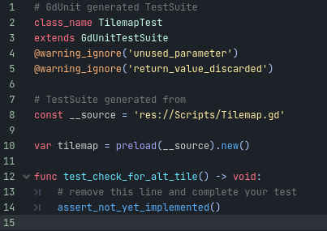

# Colonization Conquerors
## Repository Contents:
- Source Code: The heart of our project lies here, where we've meticulously crafted the game's functionality and mechanics.
- README: This document provides an overview of the project, team information, major features, stretch goals, use cases, non-functional requirements, and more. It serves as your guide to Colonization Conquerors.
- Weekly Reports: Our weekly reports detail our progress and accomplishments, helping you stay up to date with our development journey.
- Projects: The Projects page outlines our scheduled tasks, assignments, and responsibilities for each team member, offering insight into our project's ongoing development.
___
## Overview:
An ongoing project aimed at developing a game that replicates the gameplay of the classic 1982 game, Utopia.

### Team Members:
- Timothy Enders (Game Programmer, Game Designer)
- Grant Palmieri (Game Programmer, Game Tester)
- Joshua Murillo (Game Programmer, Audio Engineer)
- Zachary Thomas (Game Programmer, Technical Writer)
___
### **Communication**

- Private: Penn State University – Microsoft Teams, Email, Canvas
  - Throughout the course of this project’s development, the members of our team will actively communicate with each other about the design and production of the Colonization Conquerors video game.

### Product Description:
Colonization Conquerors is set to be developed as a turn-based strategy PC game inspired by the classic Utopia (1982). The game revolves around building and creating a civilization, resource management, and competitive gameplay to win matches. It aims to blend the nostalgia of Utopia's core gameplay with different visuals, and user experience enhancements.
___
### **Major Features**

- Island Development:
  - Players can create and advance their island through the construction of diverse structures, including crops, factories, and forts. Each of these structures serves distinct functions, such as sustaining the population, generating revenue, or fortifying against potential attacks.
- Resource Management:
  - Managing resources is a crucial aspect of the game. Players need to allocate resources wisely to ensure the growth and prosperity of their island. Achieving success hinges on the strategic allocation of construction efforts.
- Interaction with Rival Players:
  - "Colonization Conquerors" delivers a local two-player competitive gaming experience, enabling players to fund rebel activities on their opponent's island and incite confrontations between their PT boats and the rival's fishing boats.
- Natural Disasters & Events:
  - Random disasters and events can occur in the game, adding an element of unpredictability. These events, such as rain storms or hurricanes, can have both positive and negative effects on a player's construction.
___
### **Stretch Goals**

- User Interface Enhancements:
  - An intuitive and visually appealing user interface with clear navigation.
  - Leaderboards to showcase player rankings and scores.
- Discord Integration:
  - Incorporate an online multiplayer dimension into the game, where a third player assumes the role of the "Gamemaster" responsible for orchestrating dynamic events. The Gamemaster can wield control over various in-game parameters, such as adjusting construction costs, and weather occurrence rates, using Discord as a medium for these modifications.
___
## Software Architecture:

**Overview of the System**

In our Godot game project, the major software components include:

- Setup Menu Component: Responsible for displaying the setup menu UI, and handling user input for starting the game.
- World Component: Central to gameplay, manages player interactions on a tile-based map, allowing players to place objects, move their cursors, and respond to input.
- Global Data Component: A singleton script that stores global variables and settings, facilitating data sharing between different parts of the game.
- Scoreboard Component: Manages UI elements for displaying player scores, round timers, and other game-related information.
- Input Validation Component: Handles input validation for text input fields, ensuring correct user input within the game.
___
### **Interfaces Between Components**

- The setup menu component communicates with the gameplay component to start and manage game rounds.
- The world component interacts with the global data component to store and retrieve game-related data.
- The scoreboard component updates its UI based on data provided by the world component.
___
### **Data Storage**

We do not currently use a database in our game project. Instead, we store data within the game engine's runtime memory.
___
### **Alternative Architectural Decisions**

Client-Server Architecture: An alternative approach could involve implementing a client-server architecture with the integration of Discord API to enable players to interact with the game through a Discord bot.

Pro
  - Enhanced Gameplay: Provides a more engaging and dynamic gaming experience by allowing a third player to supervise and modify the game's mechanics.

Con
  - Complexity: Implementing a client-server architecture can be complex, requiring more time to establish.

Database Integration: Another alternative is integrating a lightweight database system to store game data, particularly leaderboards, persistently. This could enable features like recording and displaying player statistics.

Pro
  - Persistent Leaderboards: Allows for the storage of leaderboards, ensuring that players' statistics are saved and can be viewed across sessions.

Con
  - Security Concerns: Securing player data within the database is essential, as it should only be accessible to the developers and not to any unauthorized individuals.
___
### Software Design:

**Component Definitions**

- Setup Menu Component: Consists of UI elements and logic for displaying and handling the setup menu. Key classes and elements include Setup_Menu.gd, labels, and user input handlers.
- World Component: Controls gameplay interactions on a tile-based map. Key classes and elements include TileMap.gd (for player actions and map interactions), and TileMapWorld (for rendering the map).
- Global Data Component: A singleton script with a single class Global.gd, responsible for storing and managing global game data.
- Scoreboard Component: Manages UI elements for displaying player information and a round timer. Key classes include Score_Board.gd and UI elements (labels and a timer).
- Input Validation Component: Handles input validation for text input fields. Key classes include SM_Input_1.gd, SM_Input_2.gd, and the user input handlers.
___
### **Responsibilities**

- Setup Menu Component: The setup menu labels offer guidance regarding the expected input for the user input handlers.
- World Component: TileMapWorld is a tile map, rendering game sprites, and its behavior is managed by the TileMap.gd class, which handles changes triggered by both system processes and player input.
- Global Data Component: Comprises global variables that receive input from the player via the Setup Menu Component and World Component, as well as a global variable designed to indicate the conclusion of a match.
- Scoreboard Component: The user interface displays various labels for each player, presenting information such as their current scores, total scores, the remaining number of rounds, and a countdown timer for the current round. The timer dynamically updates the time remaining on the current round label.
- Input Validation Component: This guarantees that user input in the Setup Menu Component is accurately captured as intended.
___
### Coding Guidelines:
For GDScript, we follow the official Godot Engine GDScript style guide available at GDScript Style Guide.
- We chose this guideline to maintain a standardized and consistent codebase, making it easier to collaborate and maintain the project.
- Team members will receive training and guidance on GDScript best practices and the GDScript style guide to ensure they are familiar with the standards.
___
### Use Cases (Functional Requirements):
| Use Case 1    | Player Building & Island Development |
| -------- | ------- |
| Actor | Player |
| Trigger | The player desires to initiate construction and  development on an island within Colonization Conquerors. |
| Preconditions | The player has started a new match. |
| Postconditions  (Success Scenario) | The player successfully builds and develops his land in Colonization Conquerors. |
| List of Steps  (Success Scenario) | a. The player constructs objects on the island.  b. The player manages resources and continues expanding the island. |
| Extensions/Variations  of the Success Scenario | The player can choose different structures and  resource allocation strategies. |
| Exceptions: Failure  Conditions & Scenarios | If the player’s resources are insufficient, the chosen  structures cannot be built. |

| Use Case 2    | Competitive Gameplay & Interaction with Rival Player |
| -------- | ------- |
| Actor | Players |
| Trigger | Player 1 and Player 2 want to engage in competitive  gameplay with each other. |
| Preconditions | The players are in the same game. |
| Postconditions  (Success Scenario) | Player 1 and Player 2 participate in competitive  gameplay. |
| List of Steps  (Success Scenario) | a. Both players start a session with each other.  b. They allocate resources strategically and expand their island.  c. Each player decides to fund rebel activities on the other’s island.  d. Otherwise, a confrontation between their PT boats and fishing boats occurs.  e. Player 1 and Player 2 continue to compete and strategize. |
| Extensions/Variations  of the Success Scenario | Player 1 and Player 2 can employ different tactics  during gameplay. |
| Exceptions: Failure  Conditions & Scenarios | If the session ends too early, they cannot engage in  competitive gameplay. |

| Use Case 3    | Dealing with Random Natural Disasters |
| -------- | ------- |
| Actor | Player |
| Trigger | The player encounters a random storm cloud in the game. |
| Preconditions | The player initiates a new game. |
| Postconditions  (Success Scenario) | The player copes with the natural disaster. |
| List of Steps  (Success Scenario) | a. The player observes the impending storm cloud.  b. The player can either opt to move their boat to a different  location and/or proactively construct newer structures in a  distant area to avoid potential obstacles.|
| Extensions/Variations  of the Success Scenario | The outcome of the natural disaster can vary based on  the player’s preparations. |
| Exceptions: Failure  Conditions & Scenarios | Failure to act may result in a natural disaster  inflicting substantial damage upon the player’s  constructions. |
___
## Non-Functional Requirements:

### **User Support & Documentation**

- Provide clear and comprehensive in-game help and tutorials to assist new players.
___
### **Accessibility**

- Guarantee that the game accommodates players who desire customizable control features.
___
### **Security**

- Implement security measures to prevent cheating or hacking.
- Ensure data privacy for user information if Discord integration is utilized.
___
## External Requirements:
Given the game's aim to facilitate multiplayer competition and incorporate features like leaderboards, ensuring system stability is of paramount importance to our team. Preventing unintended user inputs that could potentially disrupt the game's integrity is crucial for a seamless gaming experience, whether played solo or with others.

Furthermore, since our software will be available for download by users, it's imperative that individual users are unable to modify the program intentionally or accidentally in a manner that could disrupt the game environment.

In addition to code stability, our team is committed to maintaining robust documentation. This approach ensures that our design and implementation processes remain well-organized. This organization, in turn, allows for easy reference to previous production steps and facilitates the onboarding of new team members, ensuring they are up to speed with the project's progress.
___
## Team Process Description:
For our project, we have chosen Godot as our game engine because of its exceptional beginner-friendliness for crafting 2D games, complemented by its integrated networking capabilities. We will primarily use GDScript in Godot for our coding tasks since it closely resembles Python, a language the team is proficient in. In terms of audio production, we will employ Audacity as our software of choice due to its user-friendly interface and fundamental feature set, which adequately fulfills our requirements. Each team member's role has been thoughtfully assigned based on their individual skill sets and aptitude, ensuring that they are best equipped to contribute effectively to the project's success.
___
### **Top Five Major Risks**

Not focusing on what matters:

- One significant risk involves succumbing to the allure of incorporating non-essential features, potentially diverting resources from core development efforts.
- While this risk may begin as being relatively unimpactful, as our project approaches the prototype's completion, we may run into some decisions as to what needs to get done and what should be thrown out for the sake of completion.
- The greatest risk, if this issue emerges, is the waste and loss of time that could have been spent more productively.
- To mitigate this risk, our team simply needs to make sure that everyone's job is clearly defined. We also need to keep in contact with each other to update what tasks need to be completed and which ones may need to be dropped so that everyone is doing a task that is directly progressing the project toward its completion.

Unfamiliarity with each other:

- Another notable risk stems from our team's lack of prior experience working together, especially considering the project's scope; unforeseen challenges may arise.
- The chance of these issues posing any kind of threat towards the completion of our project will likely be at its highest at the beginning of our time working together and should slowly reduce itself as time goes by.
  - So far we have had some issues keeping in contact with each other due to scheduling conflicts.
- The greatest threat this issue poses is a lack of coordination between team members which would then lead to wasted time and a lack of productivity.
- To mitigate this risk, our team members tend to do most of our planning during group-focused days in our CMPSC 487W class and regularly during the first few minutes of regular class time while the instructor is setting up. That said we would still like to hold regular weekly meetings whenever possible. In this regard, the only thing we can do is update each other on our weekly availability in hopes of finding some mutual time frame as often as we can.

Experience level:

- Additionally, our chosen engine, although seemingly straightforward and suitable for the game, poses a risk as none of us have prior experience with it, and as development progresses, unforeseen complexities may emerge.
- The risk of this potential issue hindering our ability to complete the project on time is quite high compared to some of the other risks mentioned so far. Reasons for this include:
  - Godot has undertaken a significant update 3 to 4.0 which replaces many of the old built-in functions as well as their parameters compared to the old version.
    - As many tutorials and documented issues are written before 4.0, every now and then, our team members have run into instances where researching how to accomplish something in Godot takes longer than expected. We would end up trying to implement a function only to run into problems and later find out that Godot 4.0 has renamed or changed the parameters of those functions. A common response to similar issues posed by other users of the software would usually include, "This function was changed in Godot 4.0."
- The best way to mitigate this risk is by searching specifically for Godot 4.0 compatible references and sticking close to the Godot 4.0 documentation. That said, This simple fix does not completely prevent this issue from reoccurring.

Team-Based Technical Challenges:

- Building off of some of the previously declared risks. Another issue we run the risk of running into is the incompatibility of our code.
- Since our team is primarily working off of copies of the latest version of the project, there may be times when one or more of us ends up having issues with adding our most recent additions to the project without running into conflicts with another team member's code.
- The risk of this occurring may rise as the project's coding scripts are expanded. The risk runs higher still, as more of our members start taking coding roles simultaneously.
- The best way to mitigate this risk is by making sure to communicate with each other as soon as we have issues and to make it known whenever we make any significant changes to the project code. This is especially true when a member's additions are spread out through multiple coding scripts as it can be difficult to keep track of every new change if it is not clearly defined.

Time constraints:

- One of the largest issues plaguing the progression of our project is time. Whether it be a lack of time for individual members to complete tasks on schedule, or schedules not lining up for meetings where issues like scheduling would normally be dealt with, time has been the most unpredictable and impactful issue that poses the greatest risk towards the completion of this project.
- Ultimately, every other risk mentioned ends up dealing with a loss of time or productivity. The less time we are able to spend on the project, the higher the likelihood of us having to cut features from the game, or lowering the quality of the features we need to have in the long run.
- The only way to mitigate this risk is by taking the necessary steps to mitigate the previously described risks. This way, we can maximize the amount of time and the productivity of that used time towards completing the project up to the standards that we originally envisioned.
___
### **Schedule**

- To execute this project concept, our team will need to follow a series of sequential steps that will guide us toward the successful completion of Colonization Conquerors. These steps encompass:

| Date              | Task                            |
|-------------------|---------------------------------|
| 9/10/23 - 9/16/23 | Get familiar with our tools |
| 9/17/23 - 9/23/23 | Start creating Colonization Conquerors prototype |
| 9/24/23 - 9/30/23 | Continue prototype creation/testing |
| 10/1/23 - 10/7/23 | Redesign game implementation and do further testing |
| 10/8/23 - 10/14/23 | ~~Completion of prototype, begin development of beta~~ |
| 10/15/23 - 10/21/23 | ~~Completion of prototype, begin development of beta~~ |
| 10/22/23 - 10/28/23 | ~~Finalization of mechanics~~ |
| 10/29/23 - 11/4/23 | Completion of prototype, begin development of beta   Finalization of GUI, in-game sprites, and mechanics |
| 11/5/23 - 11/11/23 | Finalization of sound design   Work on extra features (Leaderboards/Discord integration) |
| 11/12/23 - 11/18/23 | Continue working on extra features |
| 11/19/23 - 11/25/23 | Finalization of documentation |
| 11/26/23 - 12/2/23 | Finalization of Colonization Conquerors |
___
### **Major Milestones**

Creation of the Colonization Conquerors Prototype:

(Every sub-milestone depends on the completion of the sub-milestone above it)

- Create a tile map:
  - Map should allow users to select tiles of their choice.
- Create placeable objects:
  - Create sprites to represent in-game objects similar to the objects found in the classic Utopia (1982) video game.
  - Once a tile has been placed, the user should have the option to ask the game to place an object of their choice on the tile of their choice.
  - If the user has the required funds to purchase the object, the object is then placed on the tile map.
  - The user who placed the object as well as the position of where that object was placed are then recorded to in-game memory.
- Have the users interact with objects:
  - Objects like the Fishing boat or PT boat should be selectable and moveable throughout the live game.
- Have objects interact with the users:
  - When users purchase a rebel object, it will randomly spawn on the opponent's land mass.
    - Rebels lower the productivity of the opponent's currency production and may damage the opponent's in-game objects if they are in range.
  - Weather events may spawn randomly and interact with the user's in-game objects.
    - Rain helping crops grow.
    - Storms and hurricanes damaging player objects.

Creation of the Colonization Conquerors Beta:

At this point, our development cycle can start more heavily relying on real testing which will guide our next steps.

- Apply heavy user testing to see what features are working as intended or broken.
- Review which necessary features need to be revised or debugged.
- Decide what additional features we believe we can add to the game before its release.
- Clean up code of already implemented features.

Finalization of the Colonization Conquerors video game:

- Finalize the design of the UI.
- Clean up in-game object interactions and related code to provide a smoother experience.
___
### **Team Structure**

- Timothy Enders
  - Game Programmer (responsible for coding and implementing the software and functionality of the game)
  - Game Designer (responsible for conceptualizing the core gameplay elements, mechanics, and user experience)
- Grant Palmieri
  - Game Programmer (responsible for coding and implementing the software and functionality of the game)
  - Game Tester (evaluates the game's functionality and balance to ensure a smooth and enjoyable player experience)
- Joshua Murillo
  - Game Programmer (responsible for coding and implementing the software and functionality of the game)
  - Audio Engineer (specializes in creating and integrating audio elements, including music and sound effects, to enhance the overall auditory experience of the game)
- Zachary Thomas
  - Game Programmer (responsible for coding and implementing the software and functionality of the game)
  - Technical Writer (creates clear and comprehensive documentation, user manuals, and guides to help players understand and navigate the game effectively)
___
### **External Feedback**

We believe the optimal moment to seek external assistance is during the initial testing phase, as it allows for potential refinements if certain aspects do not resonate with the audience. The most effective approach to gathering this input is by involving external individuals to playtest the game and share their feedback and impressions.
___
### **Current Feedback**

- Extend the Tilemap to randomly generate different islands for users to play on.
- Have two players be able to play from two different machines instead of from the same computer.
___
### **Documentation Plan**

When exploring our game's inspiration, the 1982 classic, Utopia, all of our team members had a similar thought, "What exactly is going on here?" After finding a PDF manual for the Intelevisiion game, many of our questions were answered, but not all of them. The original game's manual never went into detail about the exact relationship between player objects, currency, population density, population satisfaction, or points. The explanations were somewhat vague as to exactly what numerically leads to what. In light of this, our team decided that our game would come with a much more in-depth user guide that we plan to integrate right into the game that players can access at any time.

The user guide will include:
- Objective of the game.
- A list of objects and their functions.
- A list of game events and their functions.
- A clear explanation of how our team decided to handle the relationship between population, currency, and the point system.
___
### **Continuous Integration Plan**

When deciding what CI service to use, we first decided to research how some other Godot developers implemented CI for both building releases and running automated unit testing. From our findings, it seemed like the vast majority of people used either GitHub Actions on their own or GitLab as an external CI service that would run on some development trigger from GitHub. The following shows some pros and cons between the two that we found while considering our options:

|       **GITHUB ACTIONS**        |           **GITLAB**            |
|---------------------------------|---------------------------------|
|            **PROS:**            |            **PROS:**            |
| Integrated into GitHub by Default | Can use source code not just from GitHub |
| Simple YMAL file format | More flexible Docker file customization |
| Many Free Resources | Comes with a fair amount of free resources |
| Showcases a marketplace full of workflow templates | Built-in container registry for Docker files |
|            **CONS:**            |            **CONS:**            |
| Limited to GitHub | Less free resources to work with |
| Complex Docker Containers | Complex Docker Containers |
| May be dependent on other services for good CI | More complex YMAL file format |

**Automated Release System:**

To incorporate continuous integration into our Godot workflow, our team decided to do some research into GitHub Actions to see if there were any pre-existing frameworks out there that we could use for our project. Soon after we began our search, we stumbled upon a number of workflows related to Godot in the Action's Marketplace. We decided on "Godot Export" version 5.2.0, which provided a way for us to simply set up an export_preset.cfg file from the Godot editor for our target OS, Windows to be released. The GitHub workflow is set up to run whenever the CI testing workflow completes successfully with all tests passed. This way, every updated release of our game is a version that passes all unit tests which will help ensure that our game works properly with minimal bugs. After this, we would simply need to place the contents of the latest build of our project on GitHub before running the workflow Action automatically, to update the release which returns in the form of a windows.exe file. This file can then be easily downloaded and run from other PCs as a runnable video game, though at the moment potential players will need to tell Windows that the game is safe to open in order to run the Windows executable file. 

The implementation of our auto-release system began with a video tutorial by a YouTuber called, FinePointCGI. After reviewing this video, we decided to locate his repository to view the yml workflow and preset configuration files he used in order to analyze them and curate them to our own project and engine version.

Release CI Video Link: https://youtu.be/bIXBosDO6f8

Release CI REPO Link: https://github.com/finepointcgi/Creating-a-Celeste-Like-Character-Controller.git

**Automated Testing System:**

For our automated testing plan, we decided to use a similar approach to our continuous integration implementation by using GitHub Actions to run through a number of unit tests upon any commit to the Latest_Build directory. After some research, it seemed as though everyone on the internet recommended using the Godot testing tool, known as GUT (Godot Unit Tests). This tool is not pre-built into Godot, instead, it is an extension that can be found in the Godot engine's "Asset Library." We originally planned on implementing a GitHub Actions workflow from the Marketplace called, "Godot GUT CI." However, we ran into several issues with implementing this testing framework into GitHub. While the GUT extension works great for both the local Godot editor and VSCode, the GitHub-related limitations ultimately made our team look elsewhere for our automated testing framework.

Below are the references used during the testing of GUT as a potential framework:

GitHub Marketplace GUT Link: https://github.com/marketplace/actions/godot-gut-ci 

Godot engine/editor GUT Asset REPO Link: https://github.com/bitwes/Gut.git 

Godot engine/editor GUT Asset Wiki Link: https://bitwes.github.io/GutWiki/Godot4/Home.html
- Wiki Directory for GUT Unit Test Structure: https://bitwes.github.io/GutWiki/Godot4/Creating-Tests.html

VSCode Godot-Extension for GUT REPO Link: https://github.com/bitwes/gut-extension.git (**NOTE:** requires Godot-Tools extension to work)

Eventually, our team came across another unit testing extension for Godot that many internet resources did not mention called, gdUnit, specifically gdUnit4 for Godot version 4.0 and above. This framework accomplished a similar function to the GUT framework, however, this extension showcased a Continuous Integration YMAL file in its documentation that allowed us to quickly set up our version of the workflow to successfully trigger and run our unit tests whenever the Latest_Build directory is committed to.

gdUnit4 GitHub REPO Link: https://github.com/MikeSchulze/gdUnit4.git

gdUnit4 Documentation Link: https://mikeschulze.github.io/gdUnit4/
- Asserts Guide Link: https://mikeschulze.github.io/gdUnit4/asserts/index/
- Advanced Testing Guide Link: https://mikeschulze.github.io/gdUnit4/advanced_testing/index/
- Continuous Integration YMAL File Example Link: https://mikeschulze.github.io/gdUnit4/faq/ci/

When using gdUnit4, while similar to GUT, is still quite different when it comes to its testing system. In the editor with the gdUnit4 plugin enabled, when right-clicking on a function, the ability to create a test is shown at the bottom of the list of options. Once chosen, a file is automatically created in the test directory of the project that is associated with the script that the chosen function belongs to as shown below:

Here a function called 'check_for_alt_tile' in the script 'Tilemap.gd' is right-clicked and the 'Create Test' option is chosen:

Once selected, you will be taken to a testing script which includes the name of the original script the function was located in followed by the suffix 'Test.gd' as shown below. Since GDScript files are typically placed in a directory called 'Scripts', the extension automatically creates a folder called 'Test' with a subdirectory called 'Scripts'. Any tests created for functions belonging to the script 'Tilemap' will now automatically be placed in 'test/Scripts/TilemapTest.gd'. 

For **manual** creation of new tests, if a test is created for a function in 'Tilemap', the tests should be written in 'test/Scripts/TilemapTest.gd'. Otherwise, if the test is created for a function belonging to another script, it should be placed in 'test/Scripts/script_nameTest.gd'. The contents of 'script_nameTest.gd' should follow the format shown below where:

**class_name = *script_nameTest***

**extends GdUnitTestSuite**

**@warning_ignore('unused_parameter')**

**@warning_ignore('return_value_discarded')**

**const __source = *Relative path from 'test/' (Example: 'res://Scripts/Tilemap.gd')***

**Followed by all function tests relavant to that script.**

Visual Example:

In the image above, it can be seen that when a test is automatically generated in the Godot editor, the test function is followed by a default 'assert_not_yet_implemented()' function that fails the test.

The following shows the completed test function for 'check_for_alt_tile' which checks if the given coordinate is out of bounds of the playable map region. The function tests if coordinate (1, 1) is out of bounds or not, and expects the function to return false indicating that (1, 1) is not out of bounds:

Notice how when creating a test, you need to use the '__source' constant to load a new instance of the original script and assign it to a variable in order to call functions from that script. From there, using the gdUnit4 asserts and advanced testing guides linked above, anyone from our team should be able to create unit tests either in the editor using the extension or manually using the specified format to ensure that our ever-changing scripts will continue to work as intended.

Some of the unit tests we plan to incorperate include tests related to:
- Score updates
- Currency updates
- Changes in coordinate positions of players/objects
- Damaging of objects
